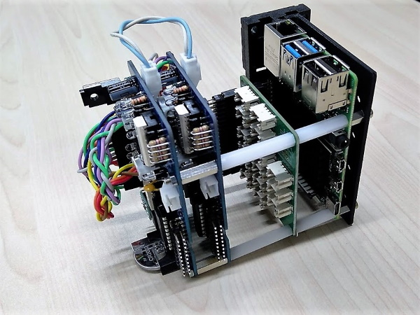

# PiFA 8xy

A prototyping board "HAT".

GPIO pins can be freely selected.

[Schematic](./PiFA_8xy/img/PiFA_8xy.pdf)

**Attention**

Please import this library before using this repository.
https://github.com/trihome/KiCad_MyLibrary

## Spec

- 4 isolated inputs and 4 isolated outputs.
  - J3(Y) is Output, and J5(X) is Input.
  - Connect these connectors to the Raspberry Pi Pins.
  - [J3 and J5: B4B-XH-A(LF)(SN)](http://akizukidenshi.com/catalog/g/gC-12249/)
  - [Raspberry Pi Pins: QI(2550)connectors](http://akizukidenshi.com/catalog/g/gC-12150/)
- Supply 24V power to J7.
  - J2 is Input / Output for FA(24V)
  - Recommended [Terminal block](https://www.togi.co.jp/product/interface/1072/) and [Cables](https://www.togi.co.jp/product/harness-cable/2661/) or QI(2550)connectors.
- Selectable Sink(NPN) / Source(PNP) : J1(Input), J4(Output)
  - U6: Transistor array, you have to choose.
    - J4 = [Sink(NPN)](http://akizukidenshi.com/catalog/g/gI-10669/)
    - J4 = [Source(PNP)](http://akizukidenshi.com/catalog/g/gI-10957/)
- I2C-bus voltage-level translator (3.3 to 5 V)
  - [U1: AE-PCA9306](http://akizukidenshi.com/catalog/g/gM-05452/)
  - I2C Output connector
    - J6: Pin Header (5V)
    - J8: GROVE (5V)
- RTC
  - [U4 : DS1307+](http://akizukidenshi.com/catalog/g/gI-06949/)
  - [BT1: CH243-2032LF](http://akizukidenshi.com/catalog/g/gP-02019/) and CR2032

## Example of use

### Terminal block

- [Terminal block](https://www.togi.co.jp/product/interface/1072/)
- [Cables](https://www.togi.co.jp/product/harness-cable/2661/)

### Stack
If you need more I/O ports, you can increase them by stacking boards.

- The board sandwiched in the middle is [Grove Base Hat for Raspberry Pi](http://wiki.seeedstudio.com/Grove_Base_Hat_for_Raspberry_Pi/)
- DIN rail bracket: [example](https://www.takachi-el.co.jp/products/DRA)
