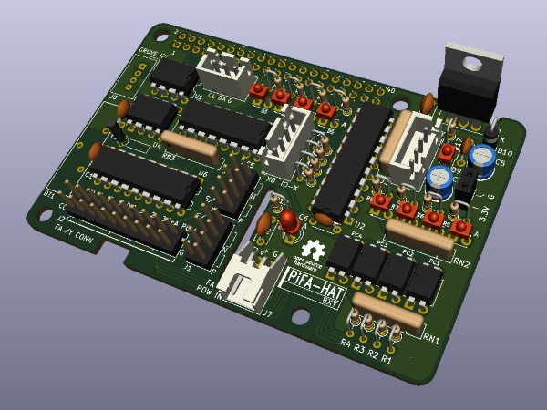

# PiFA HAT

This board will make it possible to connect equipment used at the factory  (ex: switches, sensors, relays, at all...) to your Raspberry Pi.
It can isolate connected equipments from Raspberry Pi.

**Attention**
Please import this library before using this repository.
https://github.com/trihome/KiCad_MyLibrary

**Manufacturing process**
[Manual (Japanese only)](./doc/README_pcb.jp.md)

## [PiFA 8xy](./PiFA_8xy/)

A prototyping board "HAT".
GPIO pins can be freely selected.

- 4 isolated inputs and 4 isolated outputs.
- Selectable Sink(NPN) / Source(PNP)
- I2C-bus voltage-level translator (3.3 to 5 V)
- RTC

