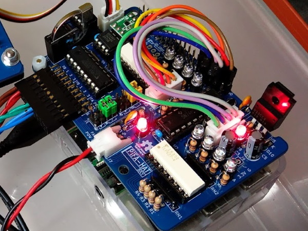

# PiFA HAT

This board will make it possible to connect equipment used at the factory  (ex: switches, sensors, relays, at all...) to your Raspberry Pi.
It can isolate connected equipments from Raspberry Pi.

**Attention**

Please import this library before using this repository.
https://github.com/trihome/KiCad_MyLibrary

## PiFA 8xy

A prototyping board "HAT".
GPIO pins can be freely selected.

[Schematic](./PiFA_8xy/img/PiFA_8xy.pdf)

- 4 isolated inputs and 4 isolated outputs.
  - J3(Y) is Output, and J5(X) is Input.
  - Connect these connectors to the Raspberry Pi Pins.
  - [J3 and J5: B4B-XH-A(LF)(SN)](http://akizukidenshi.com/catalog/g/gC-12249/)
  - [Raspberry Pi Pins: QI(2550)connectors](http://akizukidenshi.com/catalog/g/gC-12150/)
- Supply 24V power to J7.
- Selectable Sink(NPN) / Source(PNP) : J1, J4
- I2C-bus voltage-level translator (3.3 to 5 V)
  - [U1: AE-PCA9306](http://akizukidenshi.com/catalog/g/gM-05452/)
  - I2C Output connector
    - J6: Pin Header (5V)
    - J8: GROVE (5V)
- RTC
  - [U4 : DS1307+](http://akizukidenshi.com/catalog/g/gI-06949/)
  - [BT1: CH243-2032LF](http://akizukidenshi.com/catalog/g/gP-02019/) and CR2032

