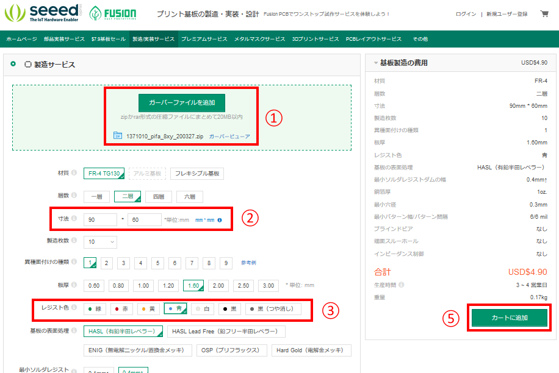
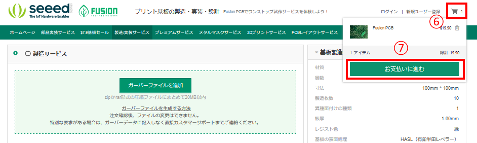
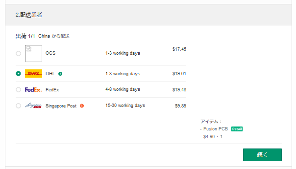

# 製作方法について

## 部品の入手

大半の部品は、秋月電子通商さんで購入できます。
一部、取り扱いのない部品については、以下から購入可能です。
（端子台などのFA用部品は、勤め先で取引している電材屋さんで購入するのが望ましいです）

|部品名|入手先|通販|
|---|---|---|
|集合抵抗 4P 4.7kΩ|千石電商さん|[リンク](https://www.sengoku.co.jp/mod/sgk_cart/detail.php?code=EEHD-05ST)|
|^|マルツさん|[リンク](https://www.marutsu.co.jp/pc/i/435604/)|
|端子台|マルツさん|[リンク](https://www.marutsu.co.jp/pc/i/1544810/)|
|^|misumiさん|[リンク](https://jp.misumi-ec.com/vona2/detail/222000477644/?HissuCode=PCX-1H20)|
|端子台ケーブル|yahoo shoppingさん|[リンク](https://store.shopping.yahoo.co.jp/akin-do/tao-00009.html)|
||||

## 基板の製作

各ディレクトリ配下に、`gerver`ディレクトリがあるので、この中のファイル一式を、PCB業者に制作依頼します。

（一例）
- [Fusion PCB](https://www.fusionpcb.jp/)
- [P板.com](https://www.p-ban.com/)

### Fusion PCBでの注文手順

※2020年3月時点の手順です。
※費用はPayPalアカウントかクレジットカードで支払います。

1. ユーザー登録
    https://www.fusionpcb.jp/register.html

    [こちら](http://tomokatsu.hatenablog.com/entry/2017/06/14/213324)を参考に、ユーザー登録します。
    
    ※住所は英語表記です。（日本での表記と逆順）

1. gerverディレクトリの中のファイル１０個をZIPで圧縮

1. 発注
    https://www.fusionpcb.jp/fusion_pcb.html

    

    1. 「ガーバーファイルを追加」を押して、先ほどのZIPファイルをアップロード
    1. 寸法は 90 x 60 mmを指定
        - 自動で入力される場合もあります
        - 100 x 100 mmサイズ以下かつ、１０枚以下は1ロットの基板費用は$5以下
    1. レジスト色は好きな色を選ぶ（黒つや消しは若干高価）
    1. その他の指定はデフォルトのまま
    1. 「カートに追加」ボタンを押す
    1. カートをクリック
    1. 「お支払いに進む」ボタンを押す
    
    1. 「安全な支払いを選択」を押して、（ログインしてない場合は）ここでログイン
    1. 送り先の確認（アカウント情報から紐付けで自動代入）
    
    1. 配送業者を選ぶ
        - 急ぐときはDHL, FedEx, OCSなどの航空便を選ぶ。送料約$20前後。
    1. 費用を支払う

航空便を使った場合、納期の目安は平常時（中国内での季節のイベントがないとき）で実働5日～10日くらいです。

以上
